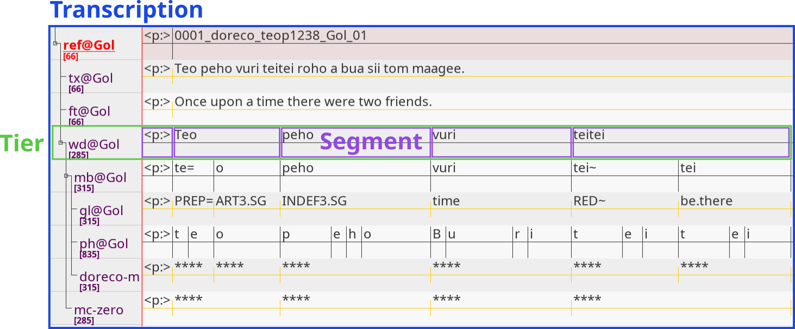

# Corflow
A file conversion/manipulation software for corpus linguistics.

* See the [Github's wiki](https://github.com/DoReCo/corflow/wiki) for documentation.
* Current version: **3.3.0** from **2025-02-14**. For a complete list of changes, see the [Changelog](CHANGELOG.md).

## What is Corflow?

**Corflow** is a tool written in Python to (a) manipulate files or (b) change a file's format, mainly applying to files used in the context of **corpus linguistics** (oral linguistics) and **multi-layered annotated corpora**. It allows performing operations on a file's stored linguistic information from any supported format and to safe the changes as a file from any supported format.

As of today, Corflow supports the following file formats:

|Tool|Format|
|---|---|
|[ELAN](https://archive.mpi.nl/tla/elan)|.eaf|
|[Praat](https://www.fon.hum.uva.nl/praat/)|.TextGrid|
|[EXMARaLDA](https://exmaralda.org/de/)|.xml|
|[Pangloss](https://github.com/CNRS-LACITO/Pangloss_website)|.xml|
|[Transcriber](https://software.sil.org/toolbox/)|.trs|

Future releases are planned to include an import and export option from .csv files as well as from [ANNIS](https://corpus-tools.org/annis/).

## Getting Started

Install Corflow via PyPI using pip by typing the following command into your terminal (within an active virtual environment):

```shell
pip install corflow
```

To learn **how to use** Corflow, visit the [Github's wiki](https://github.com/DoReCo/corflow/wiki) and take a look at the Corflow [tutorial series](https://github.com/a-leks-icon/AIRAL/tree/main/corflow_scripts/tutorials) provided by the [AIRAL](https://github.com/a-leks-icon/AIRAL) project.

## Objectives

* **X-to-Y conversions**: Conversions from any supported format X to another supported format Y, e.g. from ELAN's .eaf to Praat's .TextGrid, in the same manner as [Pepper](https://corpus-tools.org/pepper)'s Swiss Army knife approach.
* **One underlying model**: Manipulating a file's stored information from any supported format using the same underlying model.
* **Lossless conversions**: As little information as possible should be lost during converting a file.
* **Accessibility**: The package should be available for (a) automatic integration, (b) through command prompts and (c) a dedicated graphical interface.
* **Even more accessibility**: The package should require as few third-party libraries as possible, be easy to understand and to expand (by users adding their own scripts). The software's core audience is expected to have little to no experience with programming languages and writing code. More advanced users are expected to prefer [Pepper](https://corpus-tools.org/pepper/). 

## Context

Corflow, originally the *multitool*, has been started around 2015 to anonymize and convert files for the [OFROM](https://ofrom.unine.ch/) corpus (at Neuchatel, Switzerland). Initially in C++, it was reworked from 2016 to 2019 in the ANR-DFG [SegCor](segcor.cnrs.fr) project (at Orleans, France) and translated into Python. It was further developed from 2019 to 2022 within the ANR-DFG [DoReCo](https://doreco.info/) project (at Lyon, France). At present, it is actively developed and used for the [DoReCo corpus](https://doreco.huma-num.fr/) within the [AIRAL](https://www.leibniz-zas.de/en/research/research-areas/laboratory-phonology/airal) project (at ZAS Berlin).

## Limitations

* No user interface provided.
* No customized error messages.

Testing has been limited and users should expect potential errors. TEI import is still in development. 

## How does it work?

The following edited screenshot taken of the file `doreco_teop1238_Gol_01.eaf` from the [DoReCo corpus version 2.0 for the language *Teop*](https://doreco.huma-num.fr/languages/teop1238) in ELAN illustrates Corflow's model:



Corflow is built around a `Transcription` class used for *universal* information storage: all information from all the supported formats fit in. Import scripts/functions, e.g. *fromElan*, instantiate a `Transcription` object and fill it with the file's information; export scripts/functions, e.g. *toElan*, use a `Transcription` object to write a file. Manipulations are expected to operate on `Transcription` objects (after the import and before the export). In practice, this can vary as manipulations are open and dependent on the user's needs.

Generally, a *transcription* is for oral linguists text aligned to sound whereby the alignment relies on two time points. This notion of a transcription is captured in Corflow by the `Segment` class. A `Segment` object consists of text (`content`) with a `start` and `end` time. Segments might not be linguistic units, and might not be units at all (and conversely, a linguistic unit like the *pause* might have no corresponding `Segment`). A set of `Segments` corresponds to a `Tier` object and a set of `Tiers` corresponds to the whole `Transcription`. We don't claim here that all tiers, that is, all sets of segments, are linguistic transcriptions. They can also represent translations, annotations, etc. Tiers, like segments, are type-neutral.

Transcriptions, tiers and segments contain many more information and allow to access this information using different attributes and methods. For example, the `metadata` attribute contains all information around the transcription: where, when, who, how, ... The `parent` method and similar methods capture the hierarchical relations between segments and tiers. To learn more about the different attributes and methods available, visit the [Github's wiki](https://github.com/DoReCo/corflow/wiki) and take a look at the Corflow [tutorial series](https://github.com/a-leks-icon/AIRAL/tree/main/corflow_scripts/tutorials) provided by the [AIRAL](https://github.com/a-leks-icon/AIRAL) project.

## Conclusion

The question of [file conversion](https://corflo.hypotheses.org/122) might never be answered in a satisfactory manner. Originally just an nth homemade conversion tool, our hope is Corflow becomes an easily accessible package for other teams and projects to use either as is, for basic use, or by being able to quickly adapt it to their requirements.

## Author and Developers

Corflow was created and is developed by [François Delafontaine](https://github.com/Delafontainef), and is actively developed and maintained by [Aleksandr Schamberger](https://github.com/a-leks-icon).

## References

DoReCo 2.0 database:

* Seifart, Frank, Ludger Paschen & Matthew Stave (eds.). 2024. Language Documentation Reference Corpus (DoReCo) 2.0. Lyon: Laboratoire Dynamique Du Langage (UMR5596, CNRS & Université Lyon 2). DOI:10.34847/nkl.7cbfq779

DoReCo 2.0 Teop dataset:

* Mosel, Ulrike. 2024. Teop DoReCo dataset. In Seifart, Frank, Ludger Paschen and Matthew Stave (eds.). Language Documentation Reference Corpus (DoReCo) 2.0. Lyon: Laboratoire Dynamique Du Langage (UMR5596, CNRS & Université Lyon 2). https://doreco.huma-num.fr/languages/teop1238 (Accessed on 14/02/2025). DOI:10.34847/nkl.9322sdf2

Methods used in building DoReCo:

* Paschen, Ludger, François Delafontaine, Christoph Draxler, Susanne Fuchs, Matthew Stave & Frank Seifart. 2020. Building a Time-Aligned Cross-Linguistic Reference Corpus from Language Documentation Data (DoReCo). In Proceedings of The 12th Language Resources and Evaluation Conference, 2657–2666. Marseille, France: European Language Resources Association. https://www.aclweb.org/anthology/2020.lrec-1.324 (2024/03/05).

## License

Corflow and this repository are licensed under the [Creative Commons Attribution 4.0 International (CC BY 4.0)](LICENSE) license. For a quick review of the license, visit the [license's website](https://creativecommons.org/licenses/by/4.0/).